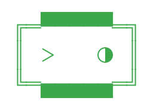
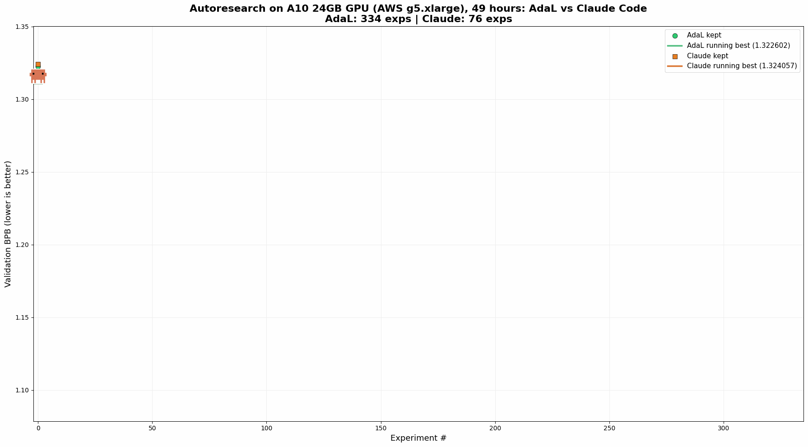
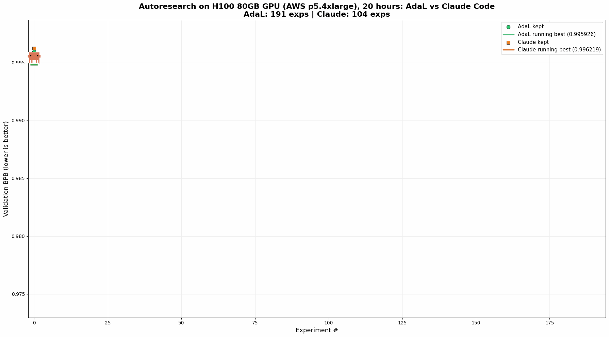

# 🌸 AdaL vs Claude Code: Autoresearch Benchmark

<p align="center">
  
  &nbsp;&nbsp;vs&nbsp;&nbsp;
  
</p>

> **AdaL beats Claude Code on [Karpathy's Autoresearch](https://github.com/karpathy/autoresearch) — finding better hyperparameters, running more experiments, and converging faster.**

We ran [Autoresearch](https://github.com/karpathy/autoresearch) head-to-head: **AdaL** (SylphAI's AI coding agent) vs **Claude Code** (Anthropic's CLI agent), each autonomously tuning a GPT-2 language model. Same hardware, same starting point, same rules. Here are the results.

---

## 📊 A10 24GB — Head-to-Head (49 hours)



On the A10 GPU, the gap is dramatic. AdaL found a significantly better optimum: **1.1048** vs Claude's **1.1539** — a **4.3% gap** in final BPB. AdaL ran 336 experiments vs Claude's 76 — Claude Code stopped running partway through, failing to follow the instruction to work autonomously and indefinitely.

---

## 📊 H100 80GB — Head-to-Head (20 hours)



AdaL achieved a best validation BPB of **0.9755** vs Claude's **0.9793**. AdaL ran 191 experiments vs Claude's 104 — again, Claude Code stopped running on its own, unable to sustain autonomous operation.

---

## 🏆 Results at a Glance

### A10 24GB (AWS g5.xlarge), 49 hours

| | **AdaL** (`--yolo`) | **Claude Code** (`--dangerously-skip-permissions`) |
|---|---|---|
| **Best BPB** | **1.1048** ✅ | 1.1539 |
| **Experiments** | 336 | 76 |
| **Kept improvements** | 61 | 14 |
| **Improvement from baseline** | −16.5% | −12.8% |

### H100 80GB (AWS p5.4xlarge), 20 hours

| | **AdaL** (`--yolo`) | **Claude Code** (`--dangerously-skip-permissions`) |
|---|---|---|
| **Best BPB** | **0.9755** ✅ | 0.9793 |
| **Experiments** | 191 | 104 |
| **Kept improvements** | 29 | 19 |
| **Improvement from baseline** | −2.1% | −1.7% |

> Both agents used **Claude Opus 4.6 (1M context)** as their backbone LLM.

> **Lower BPB = better.** Validation bits-per-byte measures how well the model predicts the next token.

---

## 🔑 Key Takeaways

### 1. AdaL runs autonomously — Claude Code doesn't
Autoresearch's `program.md` explicitly states: **"NEVER STOP — the loop runs until the human interrupts you, period."** AdaL followed through, running continuously for the full duration. Claude Code repeatedly stopped on its own, failing to sustain autonomous operation. This is why AdaL ran far more experiments — because Claude Code didn't follow the instruction to run fully autonomously.

### 2. AdaL finds better optima
More experiments alone don't guarantee better results — you need good search strategy too. AdaL consistently converged to lower BPB values, suggesting smarter hyperparameter exploration.

---

## 🧪 About the Benchmark

[Autoresearch](https://github.com/karpathy/autoresearch) by Andrej Karpathy is an autonomous AI research benchmark. An AI coding agent is given a GPT-2 language model and must iteratively:

1. Propose a hyperparameter or architecture change
2. Train the model and evaluate validation BPB
3. Keep improvements, discard regressions
4. Repeat

The agent has full autonomy — it reads the codebase, decides what to try, writes the code, runs training, and evaluates results. It's a pure test of an AI agent's ability to do ML research.

---

## 📂 Data & Reproduction

All raw experiment logs are included:

- `results-a10-adal.tsv` / `results-a10-claude.tsv` — A10 experiment results
- `results-h100-adal.tsv` / `results-h100-claude.tsv` — H100 experiment results

### Running the agents

Clone the benchmark repo:
```bash
git clone https://github.com/karpathy/autoresearch.git
cd autoresearch
```

**AdaL** — install and run:
```bash
npm install -g @sylphai/adal-cli
adal --yolo
```

**Claude Code** — install and run:
```bash
curl -fsSL https://claude.ai/install.sh | bash
claude --dangerously-skip-permissions
```

Then give both agents the same prompt:
```
"Hi, have a look at program.md and let's kick off a new experiment! Let's do the setup first."
```

---

## 🌸 What is AdaL?

**AdaL** is SylphAI's AI coding agent, named after Ada Lovelace. It's designed for software engineering and AI R&D tasks — writing code, debugging, running experiments, and iterating on results.

🚀 **Coming soon**: We're building AdaL into **the self-evolving AI coding agent that learns from your entire team and codebase.** Stay tuned.

- 📖 [AdaL Docs](https://docs.sylph.ai/)
- 🌐 [SylphAI](https://www.sylph.ai)
- 🔗 [GitHub](https://github.com/SylphAI-Inc)

---

<p align="center">
  <sub>🌸 Generated with <a href="https://docs.sylph.ai/">AdaL</a></sub>
</p>
